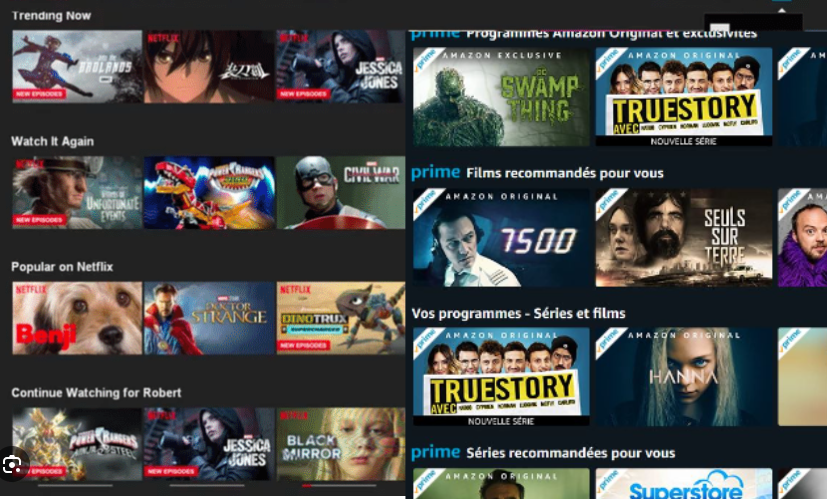
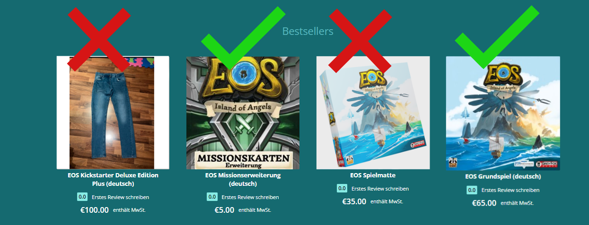

# Der Styleguide

Damit die Produkte sich alle wie Boardfolio anfühlen, empfehlen wir euch auf eure Thumbnail gestaltung Rücksicht zu nehmen. In diesem Guide zeigen wir euch wie ihr dieses also gestalten solltet. 
# Das Thumbnail
Zu aller erst ist das Ziel von Boardfolio eine möglichst Visuelle Plattform zu sein. Dabei ist es da Ziel das Kunden ersteinmal nur von den ersten Reizen eurer Produktpräsentation angesprochen werden. Nehmt euch eine Streamplattform eurer Wahl und ihr werdet ähnliches Feststellen. 

Die einfachste Erfolgsformel dafür ist:

Schriftzug des Spiels/Produktes + Thematischer Hintergrund

**Schriftzug:** Habt ihr einen Speziellen Schriftzug des Titels dient dieser als fantastisches Erkennungsmerkmal eurer Marke. 

**Thematischer Hintergrund:** Der Hintergrund kann zum Beispiel die Cover Illustration sein aber natürlich auch andere zugehörige Illustrationen/Hintergründe sein. 
Sollten es jedoch nur normale Produkt Fotos oder Visualisierungen sein fallen diese oft aus dem Schema. In den meisten fällen sind sie deswegen als Thumbnail ungeeignet.

:::info Produkt Fotos 

Sind natürlich ein dennoch wichtiger Bestandteil der Produktpräsentation und sollten in den Produktdetails auf jedenfall gezeigt werden! 

:::

