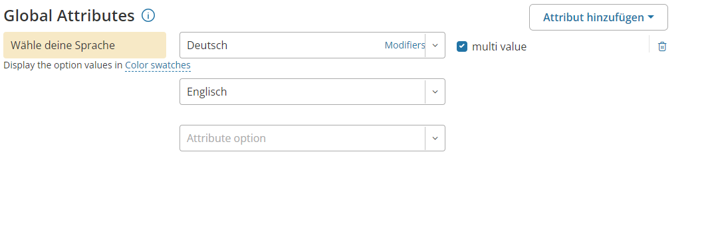
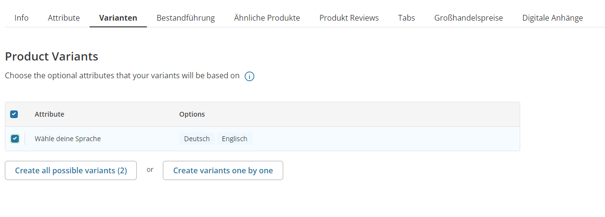
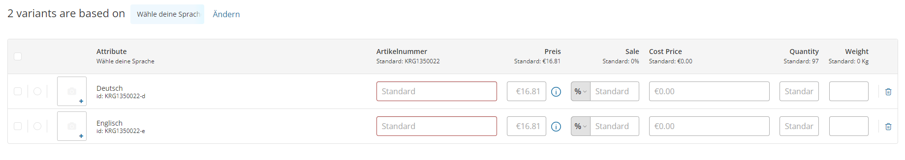

# Weitere Produkt Einstellungen

Ihr habt bereits ein oder mehrere Produkte angelegt. Nun habt ihr die Möglichkeit diese Produkte zu verfeinern mithilfe von "Varianten", "Ähnlichen Produkten", oder Anhänge von Dateien.

Um alle diese Dinge einstellen zu können geht ihr auf eure Produkte und klickt auf eins euerer bereits bestehenden Produkte und gelangt so zur entsprechenden Produktseite. Der Unterschied zu der normalen Produktseite ist dass ihr diesmal noch weitere Reiter oben seht. 

# Produkt Varianten (Verschiedene Sprachen)
Ihr habt ein Produkt in mehreren Sprachen oder Varianten verfügbar? Kein Problem ihr könnt Kunden auf der Produktseite ermöglichen sich die Sprache des Produktes auszusuchen. Für welche Version der Kunde sich dann entschieden hat seht ihr natürlich im erstellten Auftrag dann! 

**Teil 1**

Um dies einzurichten geht ihr auf den Reiter "Attribute" und navigiert dort in den Reiter "Global". Bei dem Attribut "Wähle deine Sprache" wählt ihr eure primäre Sprache per Dropdownbox aus und setzt ausserdem einen Haken bei "multi value". 

Nun erscheint eine weitere Dropdownbox in welcher ihr eine andere Sprache auswählen könnt. Speichert nun eure Änderungen. 

**Teil 2** 

Geht jetzt auf den Reiter "Varianten". 

Hier setzt ihr einen Haken bei den soeben erstellten Attributen und klickt auf "Create all possible Variants". 

Die vor euch erschienene Liste lässt euch die einzelnen Produktvarianten bearbeiten. So könnt ihr verschiedene Produktthumbnails den Sprachen zuordnen welche den Kunden je nach ausgewählter Sprache angezeigt wird.  

:::info
Wenn ihr den Kunden lediglich die auswahl zwischen verschiedenen Sprachen geben wollt dann könnt irh bereits nach Teil 1 aufhören.
:::
# Ähnliche Produkte

:::info 
Bedenkt, dass ihr um diese Funktion zu nutzen mindestens 2 Produkte angelegt haben müsst.
:::

Ihr kennt diese Funktion vermutlich von anderen Online Shops: Solltet ihr euch einen Artikel genauer anschauen kommen unter diesem Vorschläge von weiteren Artikel welche in Zusammenhang mit diesem gebracht werden. Dies könnten Erweiterungen des Produkts sein genausogut aber auch Produkte welche die gleiche Zielgruppe ansprechen.

In diesem Fenster könnt ihr nun per Checkbox Produkte auswählen welche ihr in Verbindung mit eurem Produkt bringen wollt. Wollt ihr, dass diese Relation beidseitig besteht, dann aktiviert ihr zusätzlich die Checkbox "Gegenseitige Relation".

# Digitale Produkte und Anhänge

Um ein digitales Gut zu verkaufen oder Kunden zur Verfügung zustellen machen wir gebrauch von dem "Digitale Anhänge"-Tab. Mit einem Klick auf "Datei hinzufügen" bekommt ihr die Möglichkeit dieses von eurem lokalen PC oder einer URL hochzuladen. 

Sobald ihr eine Datei hochgeladen habt könnt ihr diese Umbenennen und eine Kurzbeschreibung hinzufügen. Wichtig ist, dass ihr den Regler auf Kostenpflichtig stellt sollte es sich um ein Produkt handeln welches ihr verkaufen wollt.

:::danger Regler auf Kostenpflichtig
Ist der Regler **nicht** auf "Kostenpflichtig" sonder auf "Kostenlos" **kann jeder Besucher die Datei herunterladen OHNE das Produkt gekauft zu haben.**
:::

Wenn ihr den Regler auf "Free" stellt könnt ihr Vorabinformationen, welche man sich ohne Kauf des Produktes ansehen kann, bereitstellen (bspw. eine Leseprobe).

# Großhandelspreise

Solltet ihr eure Produkte an Händler Verkaufen wollen so könnt ihr für diese Kundengruppe gesonderte Preise anlegen. Diese sind in der Regel 30-40% günstiger. Wie viel ihr eure Preise reduziert ist natürlich euch überlassen. 

Im Tab "Großhandelspreise" könnt ihr eine Neue Stufe für euer Produkt erstellen. 

Das erste was ihr nun tun müsst ist das Membership auf Wholesaler umzustellen! Dann tragt ihr die Menge und den entsprechenden reduzierten Preis ein. Für ein Produkt könnt ihr mehrere Stufen anlegen (wie im Bild zu sehen). So ist es möglich, dass ihr auch einen Mengenrabatt geben könnt sobald ein Händler beispielsweise 5 Stück auf einmal kauft.

