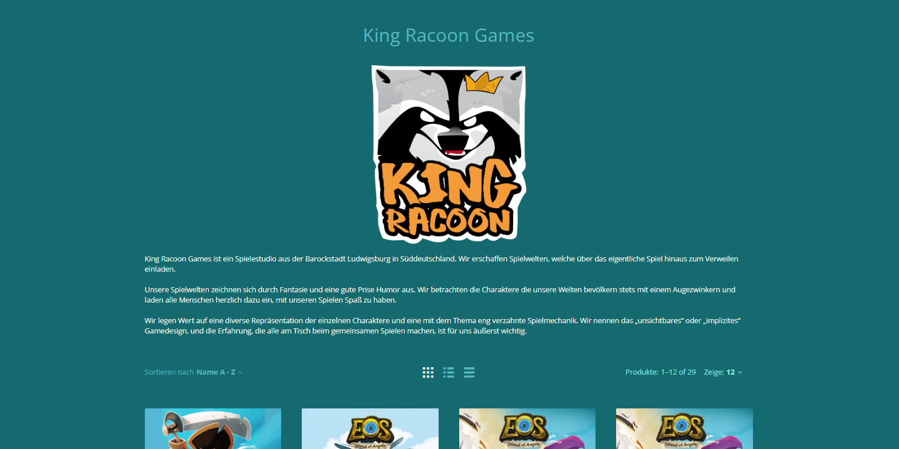

# Auf ins Backend!

Nachdem du dich erfolgreich angemeldet hast und von dem Boardfolio Team freigeschalten wurdest, kannst du dich [**hier**](https://boardfolio.gg/admin/?target=login) in dein persönliches [**Backend**](https://boardfolio.gg/admin/?target=login) des Boardfolio Shops einloggen.

Glückwunsch! Ihr seid nun in eurem eigenem Backend gelandet. Um genauer zu sein ist die Startseite welche ihr vor euch seht euer [**Dashboard**](/documentation/tutorial/dashboard). Hier werden wichtige Informationen angezeigt wie zum Beispiel offene Bestellungen, Umsätze oder Nachrichten (mehr zum Dashboard findet ihr [hier](/documentation/tutorial/dashboard)).
Auf der linken Seite seht ihr eine Menüleiste über welche ihr zu den verschiedensten unterpunkten gelangen könnt. Um die Einrichtung eures Shops abzuschließen navigieren wir als erstes zum obersten Punkt "Accountdetails".

 

Auf dieser Seite habt ihr nun die möglichkeit den **Anzeigenamen** eurer Firma/Studios sowie ein **Logo** festzulegen. Wenn ihr zudem den ungefähren Sitz eures Studios verraten wollt könnte ihr das in dem Feld "Location" angeben. 

**Ihr wollt euren Fans noch mehr über euch erzählen?** Super dann nutzt die Gelegenheit der Kurzbeschreibung. In diesem HTML editor könnt ihr anhand von Bild und Text eure Fans in eurem Shop begrüßen, Einblicke in eure Arbeit geben, oder euch selbst vorstellen. 

:::tip Deinen Shop ansehen

In der oberen Leiste kannst du stehts auf "Deinen Shop ansehen" klicken welcher dir das Frontend, also so wie es deine Kunden sehen werden, anzeigt. 

:::

