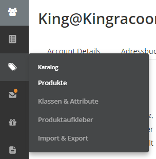
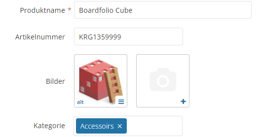
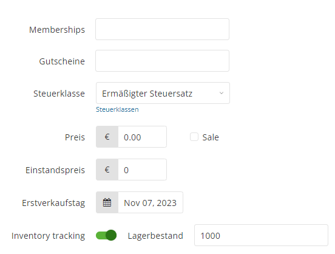

# Das erste Produkt Anlegen

Rann an den Speck! Euer erstes Produkt ist nun bereit angelegt zu werden! Dafür Navigieren wir zum Produktkatalog.

Nun seid ihr im Produkt Katalog gelandet, wo alle eure angelegten Produkte aufgelisted werden. Um ein neues Produkt anzulegen klicken wir auf **"Neues Produkt"**.
Auf dieser Seite müssen wir alle Stammdaten sowie zusätzliche Informationen zu dem Produkt angeben. 
# Basis Daten

- Der **Produktname** ist der finale Anzeigename eures Produktes im Frontend. Stellt sicher, dass dieser innerhalb eures Produktkataloges **einmalig** ist
- Solltet ihr mit euren eigenen **Artikelnummern** arbeiten könnte ihr diese ebenfall hier eintragen
- Ihr könnt beliebig viele **Bilder** zu eurem Produkt hochladen (mind. 1). Das erste Bild wird als Thumbnail eures Produktes genutzt (Die Reihenfolge kann per Drag'n'Drop geändert werden)
- In **Kategorie** sucht ihr aus den bestehenden eine passende für euer Produkt heraus
# Produkt Beschreibung

Während ihr in der Kurzbeschreibung nur die wichtigsten Fakten angeben braucht, könnt ihr euch in der Beschreibung regelrecht austoben. Die Beschreibung welche auf der Produktseite unterhalb des Produktes angezeigt wird bietet platz für detailreiche informationen zu eurem Produkt.
# Preis und Steuern

Das Wichtigste, wenn ihr ein Produkt verkaufen möchtet, sind eure Steuerklasse und der Produktpreis. Hier tragt ihr euren Nettopreis **(Preis ohne Steuern)** ein. Wenn ihr die Sale-Funktion verwendet, könnt ihr außerdem einen reduzierten Preis eingeben, den euer Produkt während des Sales annimmt.

:::danger STEUERKLASSE

Das Thema mag viele abschrecken aber es ist dennoch wichtig. Keine Sorge, wir machen es euch so einfach wie möglich!
Es gibt genau **3** Auswahlmöglichkeiten für euch: 

:::

:::note Möglichkeit 1
Ihr seid Kleinunternehmer, sprich ihr habt einen Jahresumsatz der kleiner als 22.000 € ist (Ihr müsst keine Mehrwertsteuer bezahlen):

**Ihr wählt "Kleinunternehmer"**
:::
:::note Möglichkeit 2
Ihr seid **Keine** Kleinunternehmer aber euer **gesammter Jahresumsatz im EU-Ausland** liegt unterhalb von 10.000 €: 

Ihr wählt eine der "10k" Optionen
:::
:::note Möglichkeit 3
Ihr seid kein Kleinunternehmer, habt aber einen Umsatz der größer als 10.000 € im EU-Ausland ist: 

**Ihr wählt "Standard" oder "Ermäßigt"**
:::

Verweis auf Digitale Produkt downloads