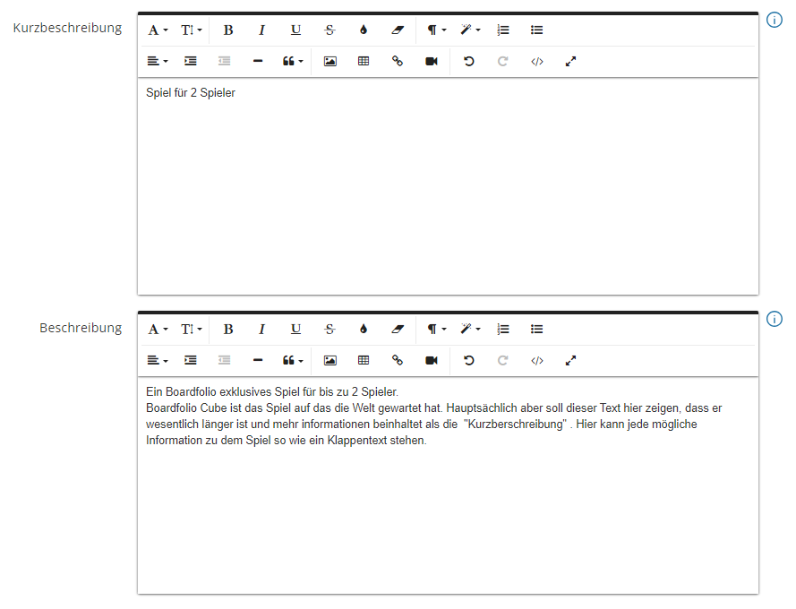

# Das erste Produkt Anlegen

Rann an den Speck! Euer erstes Produkt ist nun bereit angelegt zu werden! Dafür Navigieren wir zum Produktkatalog.

Nun seid ihr im Produkt Katalog gelandet, wo alle eure angelegten Produkte aufgelisted werden. Um ein neues Produkt anzulegen klicken wir auf **"Neues Produkt"**.
Auf dieser Seite müssen wir alle Stammdaten sowie zusätzliche Informationen zu dem Produkt angeben. 
# Basis Daten

- Der **Produktname** ist der finale Anzeigename eures Produktes im Frontend. Stellt sicher, dass dieser innerhalb eures Produktkataloges **einmalig** ist
- Solltet ihr mit euren eigenen **Artikelnummern** arbeiten könnte ihr diese ebenfall hier eintragen
- Ihr könnt beliebig viele **Bilder** zu eurem Produkt hochladen (mind. 1). Das erste Bild wird als Thumbnail eures Produktes genutzt (Die Reihenfolge kann per Drag'n'Drop geändert werden)
- In **Kategorie** sucht ihr aus den bestehenden eine passende für euer Produkt heraus
# Produkt Beschreibung

Während ihr in der Kurzbeschreibung nur die wichtigsten Fakten angeben braucht, könnt ihr euch in der Beschreibung regelrecht austoben. Die Beschreibung welche auf der Produktseite unterhalb des Produktes angezeigt wird bietet platz für detailreiche informationen zu eurem Produkt.
# Preis und Steuern

Das Wichtigste, wenn ihr ein Produkt verkaufen möchtet, sind eure Steuerklasse und der Produktpreis. Hier tragt ihr euren Nettopreis **(Preis ohne Steuern)** ein. Wenn ihr die Sale-Funktion verwendet, könnt ihr außerdem einen reduzierten Preis eingeben, den euer Produkt während des Sales annimmt.

Für die richtige Steuer müsst ihr aus der Dropdownbox die zu **euch und dem Produkt passende** option aussuchen:

:::danger STEUERKLASSE

Das Thema mag viele abschrecken aber es ist dennoch wichtig. Keine Sorge, wir machen es euch so einfach wie möglich!
Es gibt genau **3** Auswahlmöglichkeiten für euch: 

:::

:::note Möglichkeit 1
Ihr seid Kleinunternehmer, sprich ihr habt einen Jahresumsatz der kleiner als 22.000 € ist (Ihr müsst keine Mehrwertsteuer bezahlen):

**Ihr wählt "Kleinunternehmer"**
:::
:::note Möglichkeit 2
Ihr seid **Keine** Kleinunternehmer aber euer **gesammter Jahresumsatz im EU-Ausland** liegt unterhalb von 10.000 €: 

**Ihr wählt eine der "kleiner als 10k" Optionen** 
:::
:::note Möglichkeit 3
Ihr seid kein Kleinunternehmer, habt aber einen Umsatz der größer als 10.000 € im EU-Ausland ist: 

**Ihr wählt "Standard" oder "Ermäßigt"**
:::

Ob ihr nun den normalen oder ermäßigten Steuersatz nehmen sollt hängt von eurem Produkt ab. In Deutschland ist es so, dass nur Bücher den ermäßigten Steuersatz geniessen während alle[^1] anderen Produkte den normalen verrechnet bekommen.

[^1]: Produkte welche normalerweise in den Hobbybereich fallen.

# Versand

In der Sektion Versand **aktiviert ihr den Slider "Benötigt Versand"** damit der Shop automatisch die Versandkosten zu eurem Produkt hinzufügt. Dafür wird die Versandpauschale genutzt welche ihr für das jeweilige herkunftsland des Käufers eingerichtet habt. (Mehr dazu in der Sektion [Versand](/documentation/tutorial/erstesProdukt#Versand)). **Lasst also im Normalfall die Versandkosten auf 0.00€**.

:::info Feste Versandkosten
Solltet ihr für ein Produkt spezifische Versandkosten wollen (bspw. weil es sehr groß oder sehr klein ist) so könnt ihr hier eure individuellen Versandkosten eintragen. Diese überschreiben dann die Versandpauschale.
:::

:::info Digitale Produkte
Habt ihr ein [**digitales Produkt**](/documentation/Produkte/produktErweitern/#Digitale) wie z.B. eine PDF oder ein 3D Modell, dann deaktiviert den Slider "Benötigt Versand".
Mehr dazu wie man ein [**digitales Produkt**](/documentation/Produkte/produktErweitern/#Digitale) anlegt findet ihr [hier](/documentation/Produkte/produktErweitern/#Digitale)
:::

Glückwunsch ihr habt euer erstes Produkt erfolgreich angelegt! 