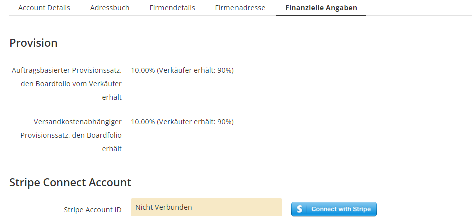
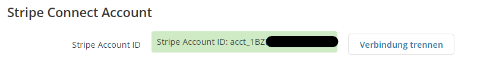
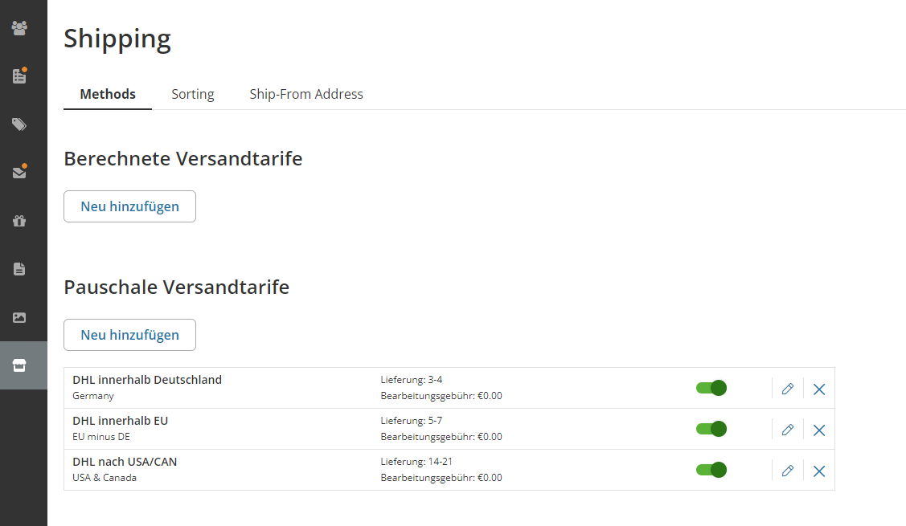
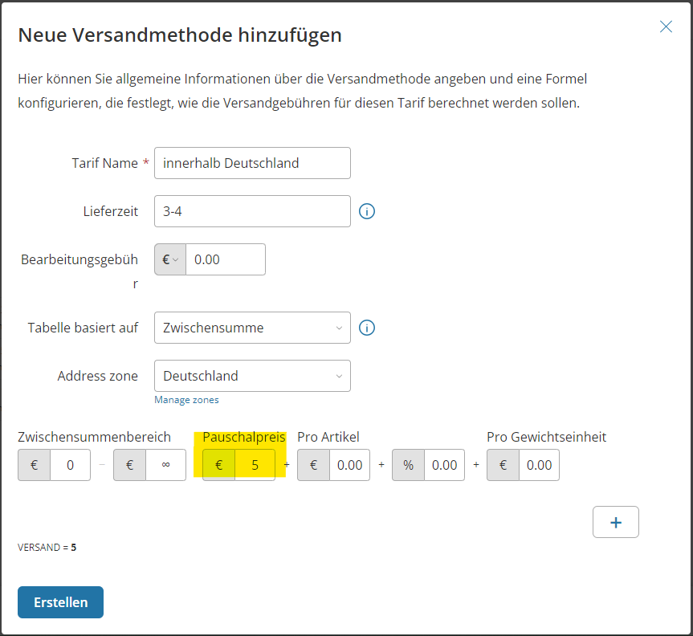
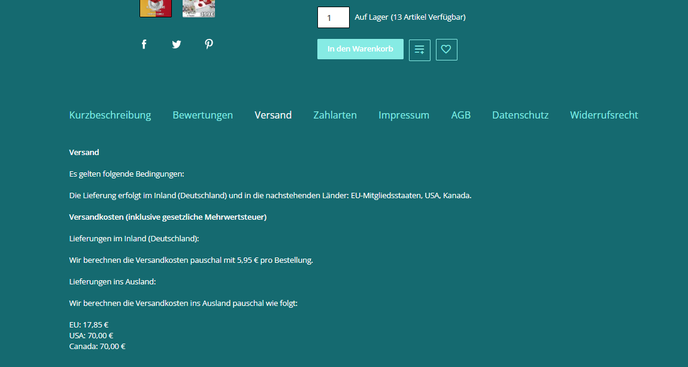

## Bank Details

:::danger Necessary

This step is absolutely necessary before you can sell products on our platform.

:::

:::tip Commission Rates

On this page, you can also see how your current commission rate is looking.

:::

## Connect with Stripe Connect

**I'm selling something, but how will the money reach me?** A very important question. We work with Stripe Connect, so it's necessary to have a Stripe account. Under the "Financial Information" tab, you'll find your Stripe Connect link. Click on "Connect with Stripe" to be redirected to the Boardfolio.gg Stripe Connect page. If you already have a Stripe account, you can log in with it. Otherwise, you now have the opportunity to create one.

Once you have **successfully connected**, it should now be displayed in your backend:

## Shipping Rates

To enable your fans to purchase your products, you must specify which countries you want to ship to and what your shipping fees are for each country. You can find this setting in the bottom menu item "Shop" > "Shipping".

Below, we have compiled an example of 3 shipping zones covering Germany, EU, and USA/Canada.

To create a new shipping rate, click on "Add New" under Flat Rate Shipping and then "Create New".

This dialog box is used to set the zone(s). In "Flat Rate," you enter your flat shipping rate for that zone.

:::info
As you can see, the flat rate is just one element in a larger formula that can be used to calculate your shipping costs accurately for each order. You can even create multiple of these formulas by pressing the **"+"**. Thus, it is possible, for example, to sell at reduced rates or offer free shipping above a certain purchase amount.
:::

## Shipping Information

You also need to adjust, adopt, or change your shipping information. Customers can see the shipping information when they are on a product page and select the Shipping tab.

You can edit the visible text in the menu under **"Design"-"Product Page Tabs"**. There, click on **"Shipping"**. Now you will see an HTML editor where you can customize your shipping information to your needs.

:::danger Disable "Maintain Default Value"
If you cannot edit the text because it is grayed out, you must first disable the "Maintain Default Value" slider.
:::

For example, you could describe different flat rates for different shipment sizes:
- [x] Books & Merchandise: 2.75€
- [x] Packages: 5.95€

Or simply adjust the existing text.

## Imprint

You also need to change your imprint under **"Design"-"Product Page Tabs"**. There, replace the text with your own imprint.

**Congratulations!** You are now ready to list your [**first product**](/documentation/tutorial/erstesProdukt)!
