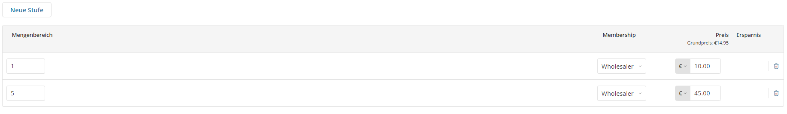

# Weitere Produkt Einstellungen

Du hast bereits ein oder mehrere Produkte angelegt. Nun hast du die Möglichkeit, diese Produkte zu verfeinern mithilfe von "Varianten", "Ähnlichen Produkten" oder Anhänge von Dateien.

Um all diese Dinge einstellen zu können, gehst du zu deinen Produkten und klickst auf eines deiner bereits bestehenden Produkte, um so zur entsprechenden Produktseite zu gelangen. Der Unterschied zu der normalen Produktseite ist, dass du diesmal noch weitere Reiter oben siehst.

# Ähnliche Produkte

:::info 
Bedenke, dass du um diese Funktion zu nutzen, mindestens 2 Produkte angelegt haben musst.
:::

Du kennst diese Funktion vermutlich von anderen Online Shops: Solltest du dir einen Artikel genauer anschauen, kommen unter diesem Vorschläge von weiteren Artikeln, die in Zusammenhang mit diesem gebracht werden. Dies könnten Erweiterungen des Produkts sein genauso gut aber auch Produkte, die die gleiche Zielgruppe ansprechen.

In diesem Fenster kannst du nun per Checkbox Produkte auswählen, die du in Verbindung mit deinem Produkt bringen möchtest. Möchtest du, dass diese Relation beidseitig besteht, aktivierst du zusätzlich die Checkbox "Gegenseitige Relation".

# Digitale Produkte und Anhänge

Um ein digitales Gut zu verkaufen oder Kunden zur Verfügung zu stellen, machen wir Gebrauch von dem "Digitale Anhänge"-Tab. Mit einem Klick auf "Datei hinzufügen" bekommst du die Möglichkeit, diese von deinem lokalen PC oder einer URL hochzuladen.

Sobald du eine Datei hochgeladen hast, kannst du diese umbenennen und eine Kurzbeschreibung hinzufügen. Wichtig ist, dass du den Regler auf Kostenpflichtig stellst, sollte es sich um ein Produkt handeln, das du verkaufen möchtest.

:::danger Regler auf Kostenpflichtig
Ist der Regler **nicht** auf "Kostenpflichtig" sondern auf "Kostenlos", **kann jeder Besucher die Datei herunterladen OHNE das Produkt gekauft zu haben.**
:::

Wenn du den Regler auf "Kostenlos" stellst, kannst du Vorabinformationen, die man sich ohne Kauf des Produktes ansehen kann, bereitstellen (bspw. eine Leseprobe).

# Großhandelspreise

Solltest du deine Produkte an Händler verkaufen wollen, kannst du für diese Kundengruppe gesonderte Preise anlegen. Diese sind in der Regel 30-40% günstiger. Wie viel du deine Preise reduzierst ist natürlich dir überlassen.

Im Tab "Großhandelspreise" kannst du eine neue Stufe für dein Produkt erstellen.

Das Erste, was du nun tun musst, ist das Membership auf "Wholesaler" umzustellen! Dann trägst du die Menge und den entsprechenden reduzierten Preis ein. Für ein Produkt kannst du mehrere Stufen anlegen (wie im Bild zu sehen). So ist es möglich, dass du auch einen Mengenrabatt geben kannst, sobald ein Händler beispielsweise 5 Stück auf einmal kauft.
