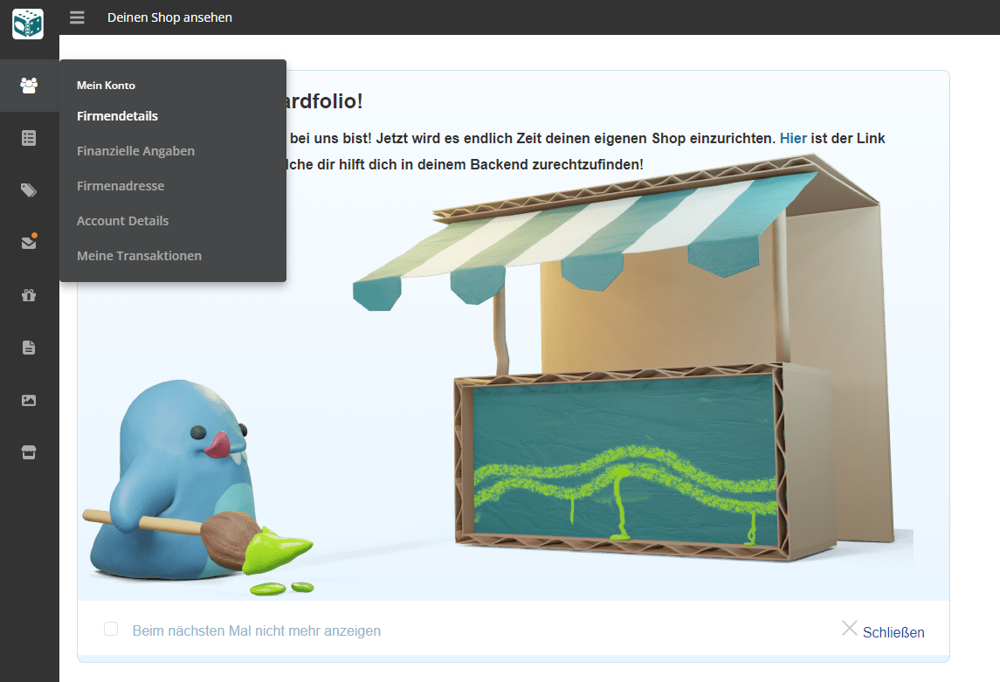
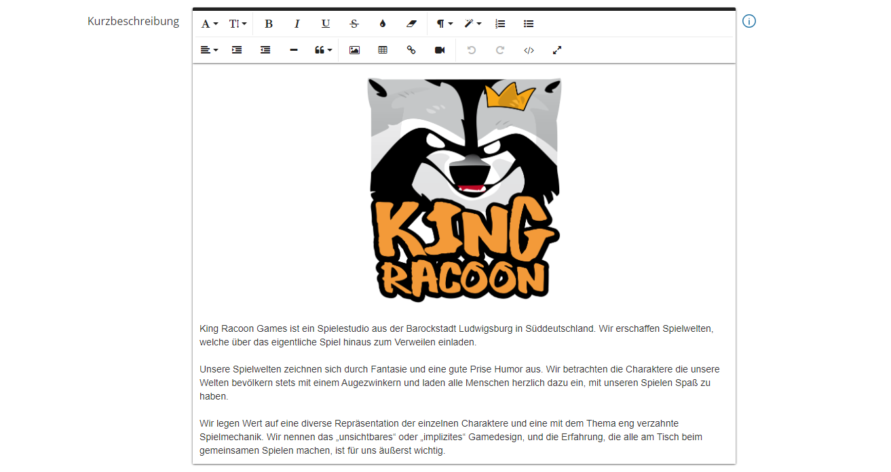
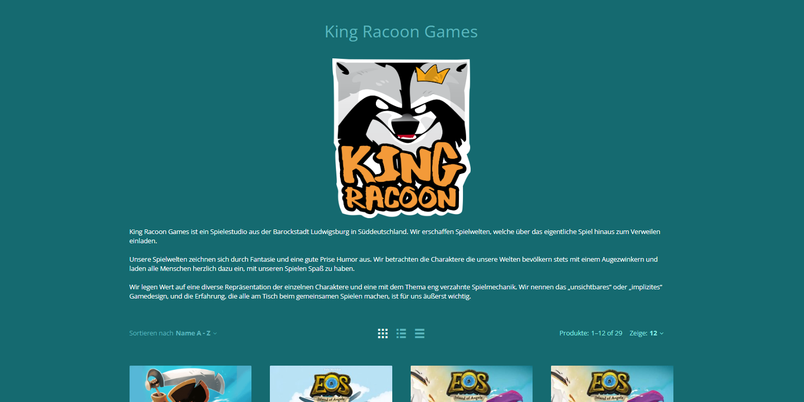

# Erschaffen wir deinen Shop!

Nachdem du dich erfolgreich angemeldet hast und vom Boardfolio-Team freigeschaltet wurdest, kannst du dich [**hier**](https://boardfolio.gg/admin/?target=login) in dein persönliches [**Backend**](https://boardfolio.gg/admin/?target=login) des Boardfolio Shops einloggen.

Herzlichen Glückwunsch! Du bist nun in deinem eigenen Backend gelandet. Um genauer zu sein, ist die Startseite, die du vor dir siehst, dein [**Dashboard**](/documentation/Backend/dashboard). Hier werden wichtige Informationen angezeigt, wie zum Beispiel offene Bestellungen, Umsätze oder Nachrichten (mehr zum Dashboard findest du [hier](/documentation/Backend/dashboard)). Auf der linken Seite siehst du eine Menüleiste, über die du zu den verschiedensten Unterpunkten gelangen kannst. Um die Einrichtung deines Shops abzuschließen, navigieren wir als erstes zum obersten Punkt "Accountdetails".

Auf dieser Seite hast du nun die Möglichkeit, den **Anzeigenamen** deiner Firma/Studios sowie ein **Logo** festzulegen. Wenn du zudem den ungefähren Sitz deines Studios verraten möchtest, kannst du das im Feld "Location" angeben.

**Möchtest du deinen Fans noch mehr über dich erzählen?** Super, dann nutze die Gelegenheit der Kurzbeschreibung. In diesem HTML-Editor kannst du anhand von Bildern und Text deine Fans in deinem Shop begrüßen, Einblicke in deine Arbeit geben oder dich selbst vorstellen.

:::tip Deinen Shop ansehen

In der oberen Leiste kannst du auf "Deinen Shop ansehen" klicken, um das Frontend, also so wie es deine Kunden sehen werden, anzuzeigen.

:::

