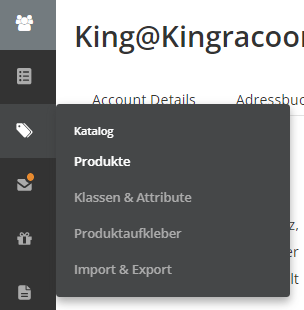
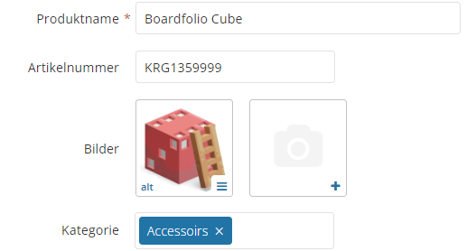
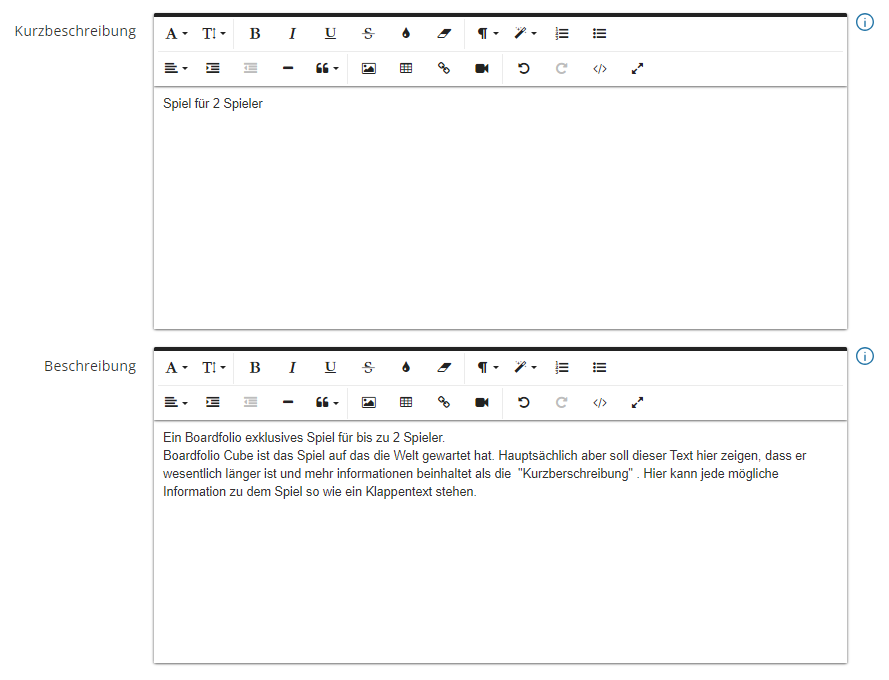
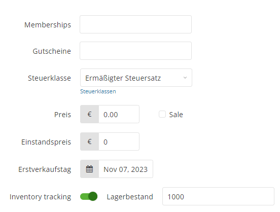
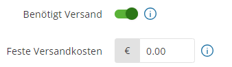

# Das erste Produkt Anlegen

Ran an den Speck! Dein erstes Produkt ist nun bereit, angelegt zu werden! Dafür navigieren wir zum Produktkatalog.

Nun bist du im Produktkatalog gelandet, wo alle deine angelegten Produkte aufgelistet werden. Um ein neues Produkt anzulegen, klickst du auf **"Neues Produkt"**.
Auf dieser Seite musst du alle Stammdaten sowie zusätzliche Informationen zu dem Produkt angeben.

## Basis Daten

- Der **Produktname** ist der finale Anzeigename deines Produktes im Frontend. Stelle sicher, dass dieser innerhalb deines Produktkatalogs **einmalig** ist.
- Solltest du mit eigenen **Artikelnummern** arbeiten, kannst du diese ebenfalls hier eintragen.
- Du kannst beliebig viele **Bilder** zu deinem Produkt hochladen (mind. 1). Das erste Bild wird als Thumbnail deines Produktes genutzt (Die Reihenfolge kann per Drag'n'Drop geändert werden).
- In der **Kategorie** wählst du aus den bestehenden eine passende für dein Produkt aus.

## Produkt Beschreibung

Während du in der Kurzbeschreibung nur die wichtigsten Fakten angeben musst, kannst du dich in der Beschreibung regelrecht austoben. Die Beschreibung, die auf der Produktseite unterhalb des Produktes angezeigt wird, bietet Platz für detailreiche Informationen zu deinem Produkt.

## Preis und Steuern

Das Wichtigste, wenn du ein Produkt verkaufen möchtest, sind deine Steuerklasse und der Produktpreis. Hier trägst du deinen Nettopreis **(Preis ohne Steuern)** ein. Wenn du die Sale-Funktion verwendest, kannst du außerdem einen reduzierten Preis eingeben, den dein Produkt während des Sales annimmt.

Für die richtige Steuer musst du aus der Dropdown-Box die zu **dir und dem Produkt passende** Option auswählen:

:::danger STEUERKLASSE

Das Thema mag viele abschrecken, aber es ist dennoch wichtig. Keine Sorge, wir machen es dir so einfach wie möglich!
Es gibt genau **3** Auswahlmöglichkeiten für dich:

:::

:::note Möglichkeit 1
Du bist Kleinunternehmer, sprich du hast einen Jahresumsatz, der kleiner als 22.000 € ist (Du musst keine Mehrwertsteuer bezahlen):

**Du wählst "Kleinunternehmer".**
:::
:::note Möglichkeit 2
Du bist **kein** Kleinunternehmer, aber dein **gesamter Jahresumsatz im EU-Ausland** liegt unterhalb von 10.000 €:

**Du wählst eine der "kleiner als 10k" Optionen.**
:::
:::note Möglichkeit 3
Du bist kein Kleinunternehmer, hast aber einen Umsatz, der größer als 10.000 € im EU-Ausland ist:

**Du wählst "Standard" oder "Ermäßigt".**
:::

Ob du nun den normalen oder ermäßigten Steuersatz nehmen sollst, hängt von deinem Produkt ab. In Deutschland ist es so, dass nur Bücher den ermäßigten Steuersatz genießen, während alle[^1] anderen Produkte den normalen verrechnet bekommen.

[^1]: Produkte, die normalerweise in den Hobbybereich fallen.

## Versand

In der Sektion Versand **aktivierst du den Slider "Benötigt Versand"**, damit der Shop automatisch die Versandkosten zu deinem Produkt hinzufügt. Dafür wird die Versandpauschale genutzt, die du für das jeweilige Herkunftsland des Käufers eingerichtet hast (Mehr dazu in der Sektion [Versand](/documentation/tutorial/erstesProdukt#Versand)). **Lass also im Normalfall die Versandkosten auf 0,00 €.**

:::info Feste Versandkosten
Solltest du für ein Produkt spezifische Versandkosten wollen (bspw. weil es sehr groß oder sehr klein ist), kannst du hier deine individuellen Versandkosten eintragen. Diese überschreiben dann die Versandpauschale.
:::

:::info Digitale Produkte
Hast du ein [**digitales Produkt**](/documentation/Produkte/produktErweitern/#Digitale) wie z.B. eine PDF oder ein 3D-Modell, dann deaktiviere den Slider "Benötigt Versand".
Mehr dazu, wie man ein [**digitales Produkt**](/documentation/Produkte/produktErweitern/#Digitale) anlegt, findest du [hier](/documentation/Produkte/produktErweitern/#Digitale).
:::

## Produkt Attribute
Als Letztes müssen wir dem Produkt Attribute zuweisen, sodass Kunden dein Produkt mithilfe der Filter und Suchfunktion finden können. Nachdem du dein Produkt fertiggestellt hast, rufst du es über deine Produktliste erneut auf. Nun siehst du weitere oben weitere Tabs, die erschienen sind.

Um Attribute hinzuzufügen, gehst du auf den Reiter "Attribute" und navigierst dort in den Reiter "Global". Bei dem Attribut "Sprache" wählst du eine Sprache per Dropdown-Box aus und setzt außerdem einen Haken bei "multi value".

Nun erscheint eine weitere Dropdown-Box, in der du eine andere Sprache auswählen kannst. Speichere deine Änderungen.

Nutze diese Seite um alle Produktdetails anzugeben wie: Sprache, Spieleranzahl und Genre.

Glückwunsch, du hast dein erstes Produkt erfolgreich angelegt!