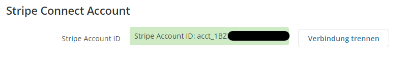
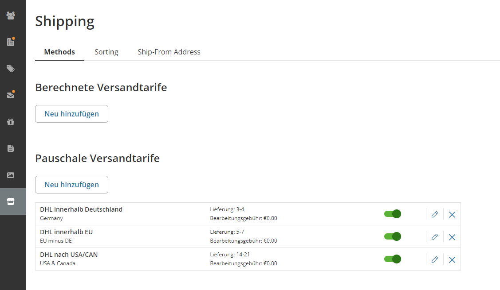
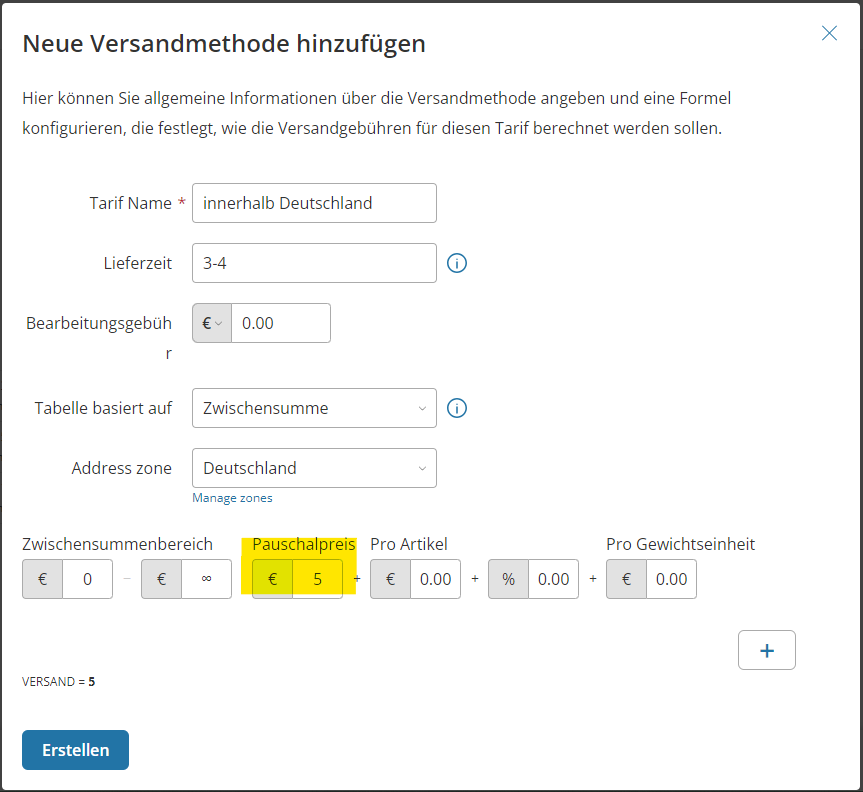

## Bankverbindung

:::danger Notwendig

Dieser Schritt ist unbedingt notwendig, bevor du Produkte auf unserer Plattform verkaufen kannst.

:::

:::tip Provisions Raten

Auf dieser Seite kannst du außerdem sehen, wie es mit deiner derzeitigen Provisionrate aussieht.

:::

## Stripe Connect Verbinden

**Ich verkaufe etwas, aber wie landet das Geld dann bei mir?** Eine sehr wichtige Frage. Wir arbeiten mit Stripe Connect, daher ist es notwendig, ein Stripe-Konto zu besitzen. Unter dem Tab "Finanzielle Angaben" findest du deine Stripe Connect Verknüpfung. Mit einem Klick auf "Connect with Stripe" wirst du auf die Boardfolio.gg Stripe Connect Seite weitergeleitet. Solltest du bereits ein Stripe-Konto besitzen, kannst du dich damit einloggen. Andernfalls hast du nun die Möglichkeit, eines zu erstellen.

Hast du dich **erfolgreich verbunden**, sollte es jetzt in deinem Backend angezeigt werden:

## Versandtarife

Damit deine Fans in der Lage sind deine Produkte zu kaufen, musst du festlegen in welche Länder du versenden möchtest und wie hoch deine Versandgebühren für das jeweilige Land ist. Diese Einstellung findest du im untersten Menüpunkt "Laden" > "Versand".

Im folgenden haben wir dir ein Beispiel von 3 Versandzonen welche Deutschland, EU und USA/Canada abdecken, zusammengestellt. 

Um einen neuen Versandtarif zu erstellen klickt ihr auf Pauschale Versantarife "Neu hinzufügen" und dann "Neu Erstellen". 

Dieses Dialogfenster wird verwendet um die Zone(n) festzulegen. In "Pauschalpreis" trägst du deine Versandpauschale für eben diese Zone ein. 
:::info
Wie du siehst ist die Pauschale nur ein Element in einer größeren Formel welche verwendet werden kann um deine Versandkosten genaustens für jede Bestellung zu berechnen. Du kannst sogar mehrere von diesen Formeln anlegen wenn du auf das **"+"** drückst. Somit ist es zum Beispiel möglich reduzierte oder versandkostenfrei ab einem gewissen Einkaufswert zu verkaufen. 
:::
## Versandinformationen

Außerdem musst du noch deine Versandinformationen berichtigen, übernehmen oder ändern. Die Versandinformationen können Kunden sehen, wenn sie auf einer Produktseite sind und den Reiter Versand auswählen.

Den sichtbaren Text kannst du im Menü unter dem Punkt **"Design"-"Produktseiten Tabs"** bearbeiten. Dort klickst du auf **"Versand"**. Nun siehst du einen HTML-Editor, in dem du deine Versandinformationen deinen Bedürfnissen anpassen kannst.
:::danger "Standardwert beibehalten" deaktivieren 
Solltest du den Text nicht bearbeiten können weil er ausgegraut ist musst du zuerst den Slider "Standardwert beibehalten" deaktivieren. 
:::

Du könntest zum Beispiel verschiedene Pauschalen für verschiedene Sendungsgrößen beschreiben:
- [x] Bücher & Warensendung: 2,75€
- [x] Pakete: 5,95€

Oder einfach den bestehenden Text anpassen.

## Impressum

Dein Impressum musst du ebenfalls unter dem Punkt **"Design"-"Produktseiten Tabs"** ändern. Dort tauschst du dann den Text durch dein eigenes Impressum aus.

**Glückwunsch!** Du bist nun bereit, dein [**erstes Produkt**](/documentation/de/tutorial/erstesProdukt) einzustellen!

